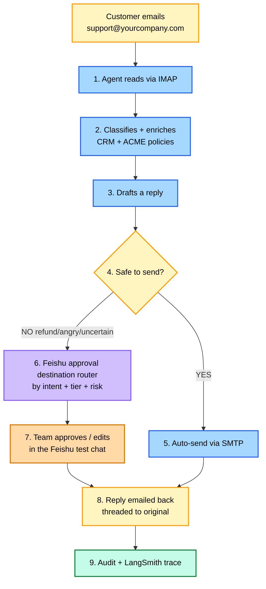

# ReplyGuard — Human-in-the-loop Support Agent Architecture

> A production-style customer support system combining LLM reasoning, deterministic policy enforcement, and human approval workflows with durable execution. Real Tencent/NetEase enterprise email in/out, Feishu test-enterprise approvals, three capability-isolated MCP servers.

## System layers

The runtime decomposes into seven layers. Each has a single responsibility; the codebase folder structure mirrors this split.

| # | Layer | Responsibility | Where it lives |
|---|---|---|---|
| 1 | **Ingestion** | Pull customer email in, push reply email out | `src/email_listener.py` (IMAP) + MCP Email Write (SMTP) |
| 2 | **Orchestration** | Sequence nodes, persist state, recover from crashes | `src/graph.py` (LangGraph + SQLite checkpointer) |
| 3 | **Intelligence** | LLM calls — Classify, Draft, Summarize Changes | `src/llm.py` + `src/nodes.py` |
| 4 | **Policy** | Two-gate routing + approval destination selection + KB retrieval | `src/policy.py` + `src/slack_router.py` + ACME KB via MCP Read |
| 5 | **HITL** | Feishu card notification, interrupt, callback handler, form editing | `src/server.py` + `src/feishu_handler.py` + MCP Approval Write |
| 6 | **Execution** | Finalize payload, idempotent send, audit log | `src/nodes.py` (Finalize / Send Email / Audit) |
| 7 | **Observability** | Tracing, cost tracking, metrics | LangSmith decorators in `src/llm.py` + Prometheus in `src/metrics.py` |

A swap at any layer is a config change, not a rewrite. Production deployment can replace enterprise IMAP with an inbound webhook service, mock CRM with Salesforce, and the ACME corpus with the company's actual policy docs — graph logic doesn't change.

## End-to-end flow (the 30-second view)



> Step 4 collapses two distinct checks (policy risk + confidence) into one box for readability — the detailed flow below shows them split.

## Detailed flow

```mermaid
flowchart TD
    Inbox([support@yourcompany.com<br/>enterprise inbox]):::email
    Inbox --> Listener[Email Listener<br/>IMAP IDLE preferred<br/>poll ~30s as fallback]:::node
    Listener --> PII[PII Redact<br/>middleware]:::middleware
    PII --> Classify[Classify Intent<br/>intent + sentiment + risk_flags + risk_level]:::node
    Classify --> Enrich[Enrich Context<br/>CRM profile + history + ACME KB]:::node
    Enrich --> Draft[Draft Response]:::node
    Draft --> Policy{Policy Risk Check<br/>refund / angry / ACME policy match?}:::decision

    Policy -->|risk detected| Router{Channel Router<br/>shipped: 2 priorities<br/>1.angry > 2.intent}:::decision
    Policy -->|no risk| Confidence{Confidence Check<br/>both confidences >= 0.85?}:::decision
    Confidence -->|below threshold| Router
    Confidence -->|above threshold| AutoSendMarker[auto_send_marker<br/>stamps state for audit trail]:::node
    AutoSendMarker --> Finalize

    Router -->|angry| ChCmp[FEISHU_CHAT_COMPLAINTS<br/>complaints chat]:::approval
    Router -->|intent=refund| ChRef[FEISHU_CHAT_REFUNDS<br/>refund chat]:::approval
    Router -->|other intents| ChTech[FEISHU_CHAT_TECHNICAL<br/>catch-all chat]:::approval

    ChCmp --> ApprovalPost
    ChRef --> ApprovalPost
    ChTech --> ApprovalPost
    ApprovalPost[Feishu Notification<br/>posts interactive card<br/>saves message ID in slack_message_ts<br/>NO interrupt yet]:::ui

    ApprovalPost --> Interrupt[Interrupt Gate<br/>dedicated node — only interrupt&#40;&#41;<br/>checkpointer persists at super-step<br/>resumes via Feishu callback]:::hitl

    Interrupt -->|callback token verified<br/>Command resume| Action{Action?}:::decision
    Action -->|reject + reason| RejectCheck{rejection_count >= 3?}:::decision
    Action -->|approve or edit| Elapsed{Approval delay > 15min?}:::decision

    RejectCheck -->|yes| ManualQueue[Manual Queue<br/>posts final status to channel,<br/>customer notified by email]:::terminal
    RejectCheck -->|no, count++<br/>carry rejection_reason| Draft

    Elapsed -->|no| Finalize
    Elapsed -->|yes| Revalidate{Revalidate Context<br/>compare context_hash}:::decision
    Revalidate -->|hash unchanged| Finalize
    Revalidate -->|hash changed| Summarize[Summarize Changes<br/>compute delta]:::node
    Summarize -->|update_message:<br/>posts delta on same msg<br/>graph re-interrupts to wait| Interrupt

    Finalize[Finalize Action<br/>PII restore + compose payload<br/>+ In-Reply-To AND References headers<br/>+ Subject: Re: ... for threading]:::node
    Finalize --> SendEmail[Send Email<br/>enterprise SMTP<br/>app-layer idempotency:<br/>skip if sent_message_id present]:::node

    SendEmail -. SMTP .-> CustInbox([Customer inbox<br/>reply threaded under original]):::email
    SendEmail --> Audit[Append-only audit log +<br/>LangSmith trace closes]:::terminal
    Audit --> End([End]):::terminal

    Enrich -. read .-> MCPRead[(MCP Read Server<br/>get_crm_profile<br/>get_customer_history<br/>get_kb_article)]:::mcpread
    SendEmail -. write .-> MCPEmail[(MCP Email Write<br/>send_email via Tencent/NetEase SMTP)]:::mcpemail
    ApprovalPost -. write .-> MCPApproval[(MCP Approval Write<br/>post_approval_request<br/>update_message<br/>Feishu form card)]:::mcpapproval
    Summarize -. write .-> MCPApproval
    ManualQueue -. write .-> MCPApproval

    classDef email fill:#fff3bf,stroke:#f59e0b,stroke-width:2px,color:#000
    classDef middleware fill:#d0bfff,stroke:#8b5cf6,stroke-width:2px,color:#000
    classDef node fill:#a5d8ff,stroke:#2563eb,stroke-width:2px,color:#000
    classDef decision fill:#fff3bf,stroke:#f59e0b,stroke-width:2px,color:#000
    classDef hitl fill:#ffc9c9,stroke:#dc2626,stroke-width:2px,color:#000
    classDef approval fill:#e9d5ff,stroke:#7e22ce,stroke-width:2px,color:#000
    classDef ui fill:#ffd8a8,stroke:#d97706,stroke-width:2px,color:#000
    classDef mcpread fill:#99e9f2,stroke:#0891b2,stroke-width:2px,color:#000
    classDef mcpemail fill:#fcc2d7,stroke:#be185d,stroke-width:2px,color:#000
    classDef mcpapproval fill:#fde68a,stroke:#a16207,stroke-width:2px,color:#000
    classDef terminal fill:#c3fae8,stroke:#15803d,stroke-width:2px,color:#000
```

## Key design points

- **Feishu post happens BEFORE interrupt, never after.** Once `interrupt()` fires, execution pauses — nothing else in that node runs. Order: `Channel Router → Approval Notification (posts card, saves message ID) → Interrupt Gate (just calls interrupt())`. Reversing this is a flow-correctness bug that pauses forever with no approval message ever sent.
- **Policy and confidence are separate gates.** A high-confidence refund still escalates. Order matters: policy first, confidence second — fast-fail on the cheaper check.
- **MCP servers are split by capability into three.** Read (CRM + KB) cannot send. Email Write cannot post approval cards. Approval Write cannot email. Prompt injection during retrieval cannot reach either I/O channel — blast radius bounded by server boundary.
- **Approval routing is priority-ordered, not fuzzy.** Shipped: `angry > by-intent` over 3 configurable Feishu chats; one `FEISHU_RECEIVE_ID` is enough for the test enterprise. Spec adds `legal/compliance > Enterprise+risk` above those — deferred per `adviserplan.md` scope, config-only to add.
- **Send idempotency is application-layer, not protocol-layer.** SMTP does not deduplicate. The Send node checks `sent_message_id` in state — if populated, skip. The `send_idempotency_key` is the lookup, the state field is the lock. This is what "idempotent send" actually means in code.
- **Finalize is split from Send.** Finalize composes (PII restore + payload + threading headers); Send executes the irreversible SMTP call. Separation makes a partial restart safe.
- **Revalidation threshold (15 min) is engineering, not magic.** Sub-15 min: customer state rarely changes. Over 15 min: meaningful chance of CRM updates. Env-tunable per tenant. When `context_hash` changed during a long pause, `Summarize Changes` updates the same Feishu card with a delta (not a silent redraft) so the approver re-decides with full info.
- **Reject paths capture the reason and bound the loop.** Reject uses the optional reason input in the Feishu card. The reason is stored as `rejection_reason` and carried into the next Draft as additional context. At 3 rejections → Manual Queue.

## Implementation rules (LangGraph-specific)

Two rules prevent the most common HITL-on-LangGraph bugs. Both are silent failures if violated.

**Rule 1 — `interrupt()` lives in its own dedicated node.** No DB writes, MCP calls, or audit entries can share the node. On resume, the node containing `interrupt()` restarts from the top — any pre-interrupt code runs again on every resume, duplicating side effects. Side effects belong in *downstream* nodes that run exactly once per resume.

**Rule 2 — Never wrap `interrupt()` in `try/except`.** `interrupt()` works by raising a special exception the LangGraph runtime catches. A broad `try/except` swallows it; the graph either hangs or skips the pause entirely. Error handling lives in *other* nodes.

## Routing rules

Two sequential gates, not one fuzzy router.

**Gate 1 — Policy Risk Check.** Escalate if **any** true: refund or money mention · angry sentiment · edge-case intent · explicit policy match (cancellation, billing dispute, account recovery, legal).

**Gate 2 — Confidence Check** (only runs if Gate 1 passes). Escalate if `intent_confidence < 0.85` OR `draft_confidence < 0.85`.

Auto-send only when **both gates pass** AND `intent in {FAQ, info, basic_technical}`. **Primary safety metric:** `false_auto_send_rate = 0%`.

## Approval UI

A human decides in ~10 seconds, not 2 minutes. Feishu card structure:

1. Customer message + thread history
2. **Why I paused** — risk breakdown showing which gate fired and which policy matched
3. Detected intent + confidence
4. Draft response — editable text area
5. Three actions: Approve · Edit & Approve · Reject

The policy justification is pulled from the same `retrieved_context` the LLM used to draft, quoted verbatim — the difference between explainable AI and "trust me." If `Revalidate` detects the context changed during the pause, the message updates with a delta panel showing what changed (e.g. `account_status: Active → Pending`). The human re-decides, now informed.

## Failure modes — what happens when things go wrong

Every failure has an explicit handling path. None are silent.

| Failure | What the system does |
|---|---|
| Server crashes mid-pause | LangGraph SQLite checkpoint persists at the last super-step. On restart, Feishu buttons still work — callback resumes at the Interrupt Gate using `slack_message_ts`. State recovered exactly. |
| SMTP transient failure | `send_retry_count++`. Up to 3 retries on the same `send_idempotency_key`. After 3 → `failed_manual` → Manual Queue + Feishu notice. |
| No human responds in 1h | Agent re-pings the channel: *"⏰ Still pending — backup channel paged."* If still no response by `sla_deadline` (24h) → auto-escalate to Manual Queue. |
| Customer sends follow-up email mid-pause | `ticket_external_status` flips to `superseded`. Old draft discarded. Feishu updates: *"⚠️ Customer replied — superseded, see ticket-XXXX."* Follow-up enters as new ticket. |
| Customer cancels ticket externally | `ticket_external_status` flips to `cancelled`. Feishu updates: *"🚫 Customer cancelled — closing."* No send. |
| Prompt injection in customer email | Read MCP has no `send_email` and no approval-channel write. Even if a jailbreak fires during retrieval, there is no path to either I/O channel until the explicit Send / Approval Write nodes. Capability separation = bounded blast radius. |
| Feishu callback token mismatch | FastAPI handler returns 401, no resume happens. Logged as security event. |
| Replayed callback | Durable graph state controls the next transition; production should add event-ID nonce storage. |
| Human rejects 3 times | Auto-routes to Manual Queue. Feishu: *"🚦 3 rejections — manual queue."* Customer notified by email. |
| LangSmith down | Agent continues. Traces buffer locally, replay when LangSmith returns. Observability outage does not break user flow. |
| LLM rate-limited or timing out | Single retry with backoff. Second failure → escalate to human (treat as low confidence). |
| Hash unchanged but human delays >24h | SLA expires anyway. Manual Queue. Time-based override of staleness check. |

## How this maps to the codebase

| Diagram region | Files |
|---|---|
| Email Listener (IMAP IDLE / poll) | `src/email_listener.py` |
| PII redact + restore middleware | `src/pii.py` |
| Classify, Enrich, Draft, Summarize Changes, Finalize, Audit nodes | `src/nodes.py` |
| Policy + Confidence routing, rejection-count guard | `src/policy.py` |
| Channel Router with priority overrides | `src/slack_router.py` |
| Interrupt + checkpointer wiring | `src/graph.py` |
| FastAPI server + Feishu callback verification + card form | `src/server.py` + `src/feishu_handler.py` |
| MCP **Read** server (CRM + KB) | `mcp_server/support_read.py` |
| MCP **Email Write** server (Tencent/NetEase SMTP, idempotent) | `mcp_server/support_email_write.py` |
| MCP **Approval Write** server (Feishu post / update / card form) | `mcp_server/support_feishu_write.py` |
| MCP client router | `src/mcp_client.py` |
| LLM client + LangSmith tracing decorators | `src/llm.py` |
| Prometheus metrics + `@timed_node` decorator | `src/metrics.py` |
| v4 agents (Researcher, Drafter, Critic) | `src/agents/*.py` |
| ACME SaaS Co fictional policy corpus | `data/acme_policies.md` |
| Mock customer DB (Salesforce-shape) | `data/customers_seed.json` |
| Restart / resume integration test | `tests/test_resume.py` |

## Tunable thresholds (env vars)

| Env var | Default | What it controls |
|---|---|---|
| `REVALIDATE_THRESHOLD_MIN` | 15 | Minutes after which an approval triggers context revalidation before send |
| `MAX_HUMAN_REJECTIONS` | 3 | Reject count that flips redraft loop to Manual Queue |
| `MAX_SEND_RETRIES` | 3 | Transient-failure retry cap before `failed_manual` |
| `SLA_DEADLINE_HOURS` | 24 | Hours of human silence before SLA expires to Manual Queue |
| `IMAP_POLL_INTERVAL_SEC` | 30 | Polling fallback when IMAP IDLE is unavailable |
| `MULTIAGENT_ENABLED` | 1 | `1` enables v4 (Researcher + Drafter↔Critic); `0` runs v3 single-agent |
| `HOST` | `127.0.0.1` | FastAPI bind. Loopback by default. Production / container deploys must set `HOST=0.0.0.0` (see `docs/threat_model.md` row A5). |
| `PORT` | `8000` | FastAPI bind port. |

Full state schema: [`spec.md §5`](../spec.md). Full env-var list: [`.env.example`](../.env.example).

## Observability

Two layers, both wired:

- **LangSmith** — every LLM call is traced via `@traceable` decorators in `src/llm.py`. Failure-slice tags (`graph_version`, `intent`, `outcome`, `risk_flags`, `confidence_bucket`) are scoped in `_ls_metadata` but **not yet emitted** to run metadata; wiring is a one-commit follow-up.
- **Prometheus** — `src/metrics.py` exposes 6 series: `hitl_tickets_total`, `hitl_node_errors_total`, `hitl_llm_tokens_total`, `hitl_node_latency_seconds`, `hitl_ticket_e2e_seconds`, `hitl_llm_latency_seconds`. FastAPI mounts `/metrics`; Grafana dashboard at `deploy/grafana/dashboards/hitl-overview.json`. Docker-compose stack scrapes every 15s.

## v4 multi-agent amendment

v4 promotes two reasoning-heavy v3 nodes into specialised agents — **Researcher** (replaces `enrich_context_node`) and **Drafter ⇄ Critic** (replaces `draft_response_node`) — coordinated by the unchanged outer graph. The 15-node parent topology, every safety gate, the channel router, the interrupt/resume protocol, and append-only audit semantics are all identical to v3. v4 is opt-in via `MULTIAGENT_ENABLED=1` (default since 2026-05-23); with the flag off, v3 runs untouched.

Full sub-graph wiring, hard invariants, and evaluator targets: [`docs/v4_multiagent.md`](./v4_multiagent.md).

## Future work

- **Human edits as a golden dataset** — accumulated `(original_draft, final_draft)` pairs become a high-signal fine-tuning corpus. Run weekly: compute edit distance per intent, feed back into prompt iteration.
- **Postgres for production** — SQLite checkpointer is single-writer; Postgres supports concurrent agents and cross-region replicas.
- **Webhook-based inbound mail** — replace IMAP IDLE with SES / SendGrid Inbound Parse for sub-second latency at scale without keepalive overhead.
- **Online evals** — currently offline; add a sampling layer that scores live LangSmith traces so regressions are caught in production, not in retrospect.
- **Multi-model routing** — cheap classifier model (Haiku-tier) for Gate 1 + expensive drafter (Sonnet-tier) for Step 4. Quantify cost reduction after build.

## References

- [`spec.md`](../spec.md) — Build spec, full state schema (§5), implementation rules (§6.5)
- [`HOW_IT_WORKS.md`](../HOW_IT_WORKS.md) — End-to-end product narrative (Jamie example)
- [`docs/v4_multiagent.md`](./v4_multiagent.md) — v4 spec amendment + hard invariants
- [`docs/threat_model.md`](./threat_model.md) — STRIDE-style threat model
- [`eval/METHODOLOGY.md`](../eval/METHODOLOGY.md) — Evaluation methodology, datasets, statistical rigor
